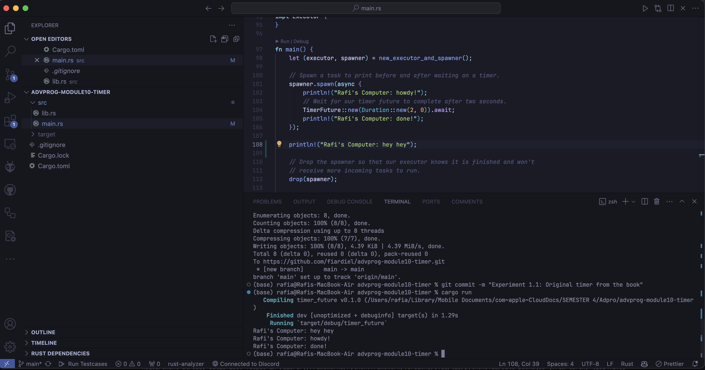
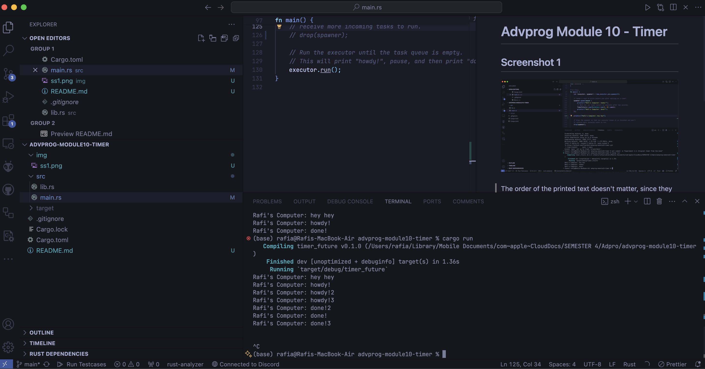
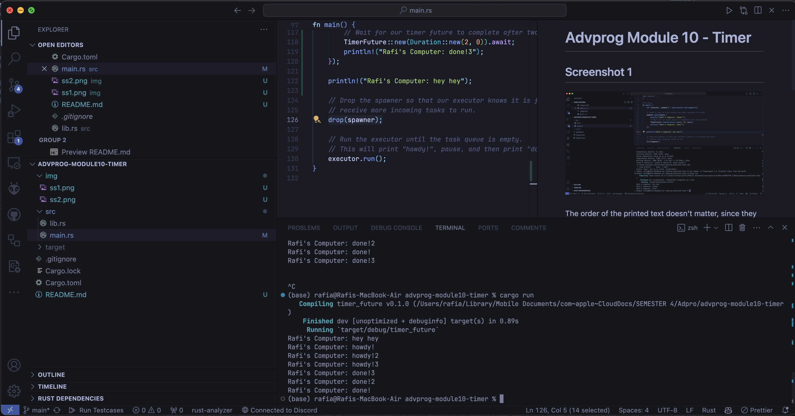

# Advprog Module 10 - Timer

## Screenshot 1

The order of the printed text doesn't matter, since they are on different threads and the first thread is asynchronous

## Drop and no drop spawner

The difference between the first and the second screenshot is that the first one is where I didn't drop the spawner. The operation will not be done until there is a spawner drop, whereas the second screenshot is where I dropped the spawner and the operation is done immediately.

